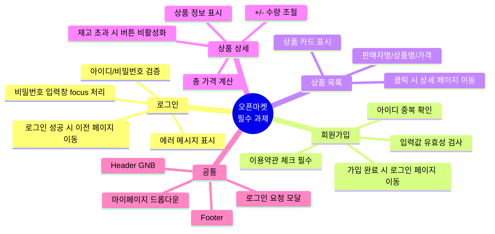
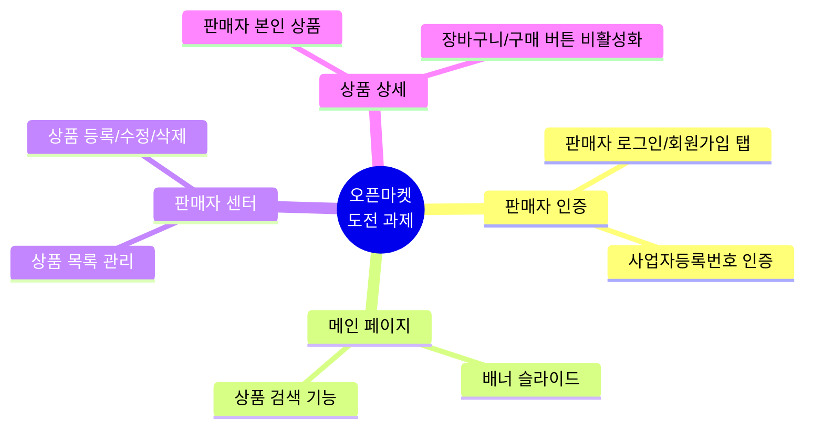
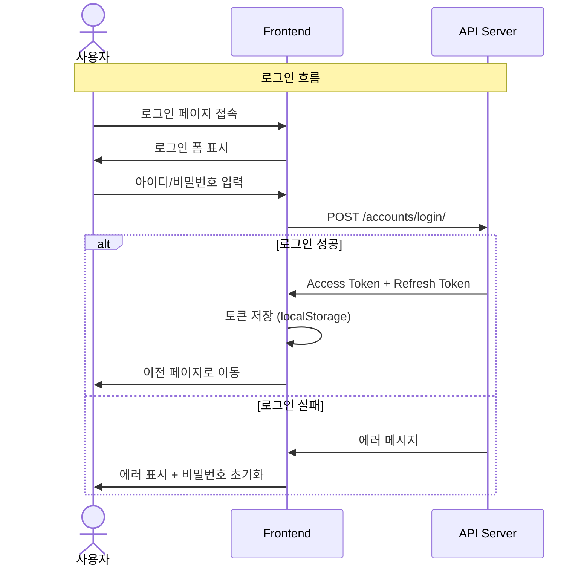
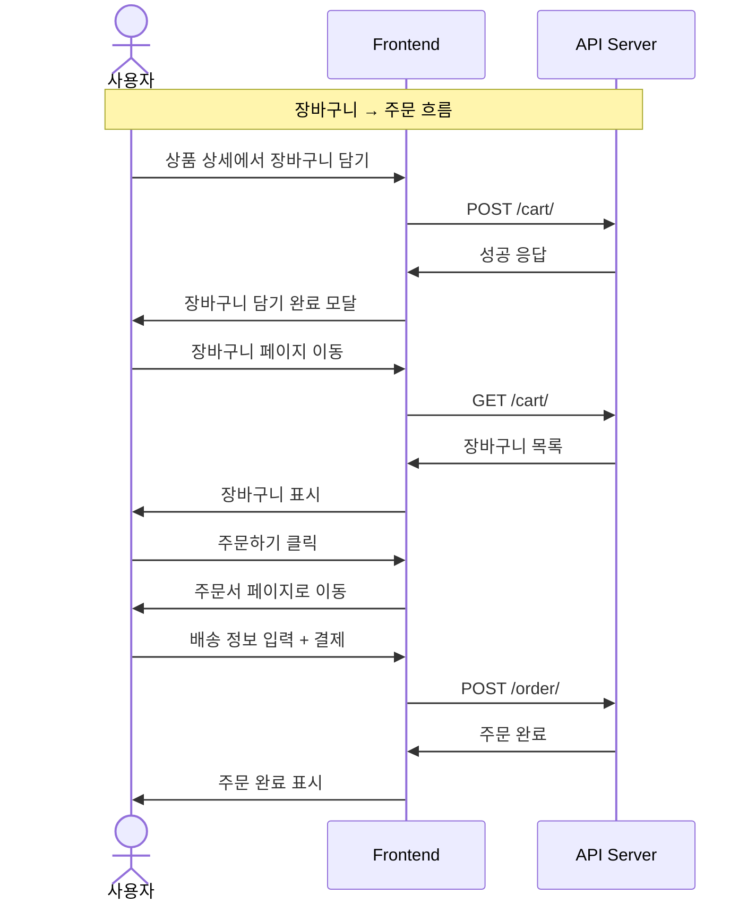
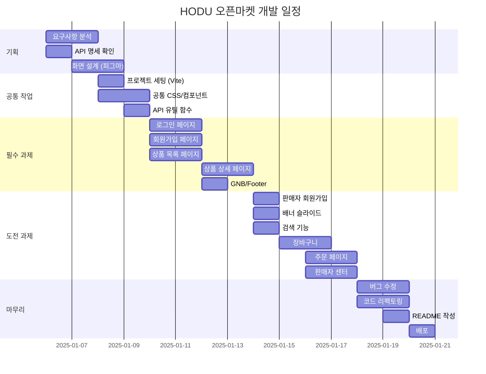
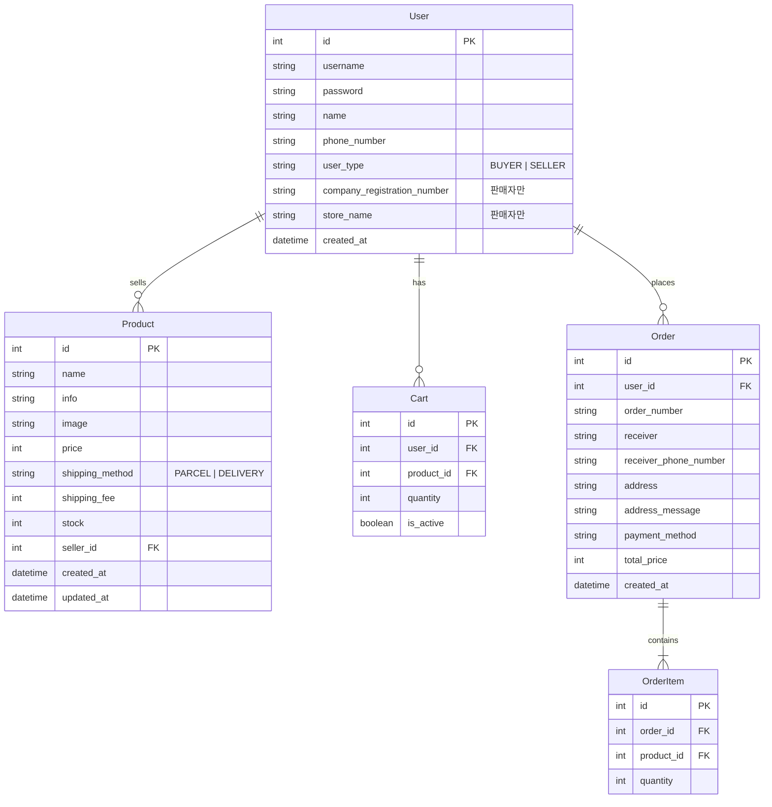
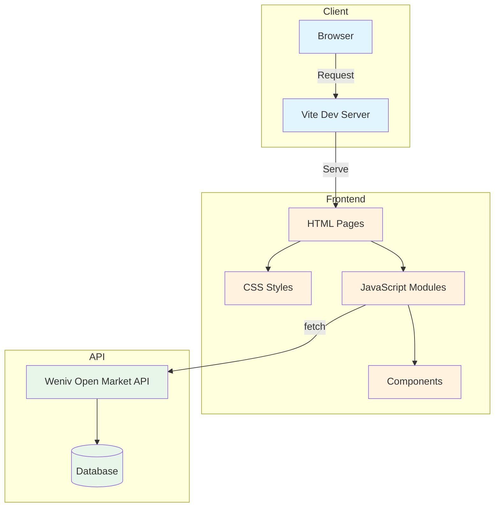
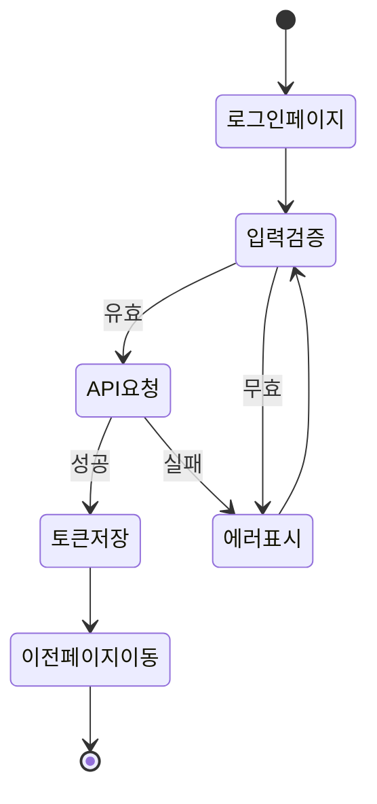
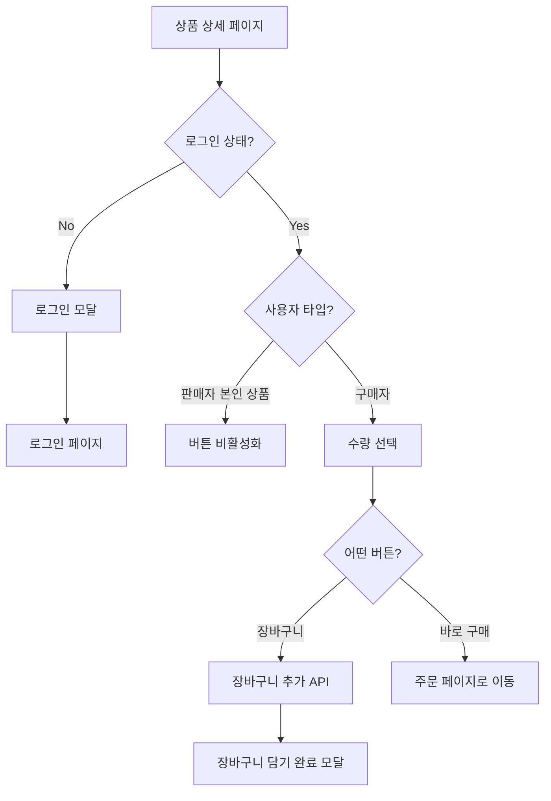
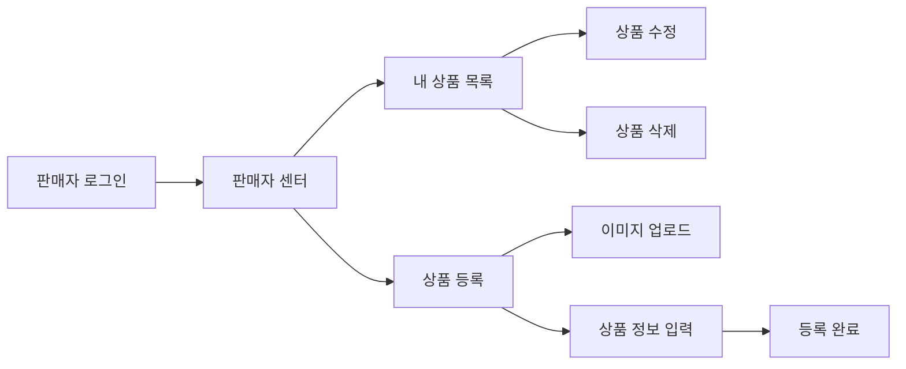

# 🛒 HODU (호두) - 오픈마켓 서비스

## 1. 목표와 기능

### 1.1 목표
- 바닐라 JavaScript를 활용한 MPA(Multi Page Application) 구현
- RESTful API 연동 및 비동기 처리 학습
- 판매자와 구매자를 구별하여 역할에 맞는 기능 제공
- 팀 협업을 통한 Git 워크플로우 경험

### 1.2 기능
- 구매자/판매자 회원가입 및 로그인 (역할 분리)
- 상품 목록 조회 및 검색 기능
- 상품 상세 정보 확인 및 수량 조절
- 장바구니 담기/수정/삭제
- 바로 구매 및 장바구니 주문
- 판매자 센터 (상품 등록/수정/삭제)
- 배너 슬라이드

### 1.3 팀 구성
<!-- TODO: 실제 팀원 정보로 수정 필요 -->
<table>
	<tr>
		<th>팀원1 (팀장)</th>
		<th>팀원2</th>
		<th>팀원3</th>
		<th>김수진 </th>
	</tr>
 	<tr>
		<td></td>
		<td></td>
		<td></td>
		<td></td>
	</tr>
	<tr>
		<td>상품 목록 페이지<br>공통 컴포넌트</td>
		<td>로그인 페이지</td>
		<td>회원가입 페이지</td>
		<td>상품 상세 페이지</td>
	</tr>
</table>

## 2. 개발 환경 및 배포 URL

### 2.1 개발 환경
| 구분 | 내용 |
|------|------|
| Front-End | HTML5, CSS3, JavaScript (ES6+) |
| Build Tool | Vite 5.x |
| 버전 관리 | Git, GitHub |
| 협업 도구 | Discord, Notion |
| 디자인 | Figma |

### 2.2 배포 URL
<!-- TODO: 배포 후 URL 수정 필요 -->
- **배포 URL**: https://open-learn-team.github.io/open-market/
- **GitHub**: https://github.com/Open-Learn-Team/open-market
- **테스트 계정**
  ```
  [구매자]
  id : buyer1
  pw : weniv1234
  
  [판매자]
  id : seller1
  pw : weniv1234
  ```

### 2.3 URL 구조

| 페이지 | URL | 파일 경로 | 설명 |
|--------|-----|-----------|------|
| 홈 (상품 목록) | `/` | `index.html` | 상품 목록, 배너, 검색 |
| 로그인 | `/pages/login/` | `pages/login/index.html` | 구매자/판매자 로그인 |
| 회원가입 | `/pages/signup/` | `pages/signup/index.html` | 구매자/판매자 회원가입 |
| 상품 상세 | `/pages/product-detail/?id={id}` | `pages/product-detail/index.html` | 상품 상세 정보, 수량 조절 |
| 장바구니 | `/pages/cart/` | `pages/cart/index.html` | 장바구니 목록, 수량 변경 |
| 주문 | `/pages/order/` | `pages/order/index.html` | 주문서 작성, 결제 |
| 판매자 센터 | `/pages/seller/` | `pages/seller/index.html` | 판매 상품 관리 |
| 상품 등록 | `/pages/seller/upload/` | `pages/seller/upload/index.html` | 상품 등록/수정 |
| 404 | `/pages/not-found/` | `pages/not-found/index.html` | 페이지 없음 |

### 2.4 API 명세

> **Base URL**: `https://api.wenivops.co.kr/services/open-market`

#### 인증 API

| 기능 | Method | Endpoint | 인증 | 비고 |
|------|--------|----------|:----:|------|
| 구매자 회원가입 | POST | `/accounts/buyer/signup/` | | |
| 판매자 회원가입 | POST | `/accounts/seller/signup/` | | 사업자등록번호 필요 |
| 로그인 | POST | `/accounts/login/` | | Access/Refresh Token 발급 |
| 로그아웃 | POST | `/accounts/logout/` | ✅ | |
| 아이디 중복확인 | POST | `/accounts/id-check/` | | |
| 사업자등록번호 확인 | POST | `/accounts/company/` | | |
| 토큰 갱신 | POST | `/accounts/token/refresh/` | | |

#### 상품 API

| 기능 | Method | Endpoint | 인증 | 비고 |
|------|--------|----------|:----:|------|
| 상품 전체 조회 | GET | `/products/` | | 페이지네이션 지원 |
| 상품 상세 조회 | GET | `/products/{id}/` | | |
| 상품 검색 | GET | `/products/?search={검색어}` | | |
| 판매자 상품 조회 | GET | `/{seller_name}/products/` | | |
| 상품 등록 | POST | `/products/` | ✅ | 판매자만 |
| 상품 수정 | PUT | `/products/{id}/` | ✅ | 본인 상품만 |
| 상품 삭제 | DELETE | `/products/{id}/` | ✅ | 본인 상품만 |

#### 장바구니 API

| 기능 | Method | Endpoint | 인증 | 비고 |
|------|--------|----------|:----:|------|
| 장바구니 조회 | GET | `/cart/` | ✅ | |
| 장바구니 추가 | POST | `/cart/` | ✅ | |
| 장바구니 수량 수정 | PUT | `/cart/{cart_item_id}/` | ✅ | |
| 장바구니 삭제 | DELETE | `/cart/{cart_item_id}/` | ✅ | |
| 장바구니 전체 삭제 | DELETE | `/cart/` | ✅ | |

#### 주문 API

| 기능 | Method | Endpoint | 인증 | 비고 |
|------|--------|----------|:----:|------|
| 주문 생성 | POST | `/order/` | ✅ | |
| 주문 목록 조회 | GET | `/order/` | ✅ | |

## 3. 요구사항 명세와 기능 명세

### 3.1 필수 과제 (구매자)



### 3.2 도전 과제 (판매자)



### 3.3 기능 흐름도





## 4. 프로젝트 구조와 개발 일정

### 4.1 프로젝트 구조

```
📦 open-market
 ┣ 📜 index.html                    # 메인 페이지 (상품 목록)
 ┣ 📜 vite.config.js                # Vite 설정
 ┣ 📜 package.json
 ┃
 ┣ 📂 assets
 ┃ ┣ 📂 css
 ┃ ┃ ┣ 📜 reset.css                 # CSS 초기화
 ┃ ┃ ┣ 📜 common.css                # 공통 스타일
 ┃ ┃ ┗ 📂 pages
 ┃ ┃   ┣ 📜 home.css                # 메인 페이지
 ┃ ┃   ┣ 📜 login.css               # 로그인
 ┃ ┃   ┣ 📜 signup.css              # 회원가입
 ┃ ┃   ┣ 📜 product-detail.css      # 상품 상세
 ┃ ┃   ┣ 📜 cart.css                # 장바구니
 ┃ ┃   ┣ 📜 order.css               # 주문
 ┃ ┃   ┣ 📜 seller.css              # 판매자 센터
 ┃ ┃   ┣ 📜 seller-upload.css       # 상품 등록
 ┃ ┃   ┗ 📜 not-found.css           # 404
 ┃ ┃
 ┃ ┣ 📂 js
 ┃ ┃ ┣ 📜 common.js                 # 공통 스크립트 (initCommon)
 ┃ ┃ ┗ 📂 pages
 ┃ ┃   ┣ 📜 home.js                 # 메인 페이지 로직
 ┃ ┃   ┣ 📜 login.js                # 로그인 로직
 ┃ ┃   ┣ 📜 signup.js               # 회원가입 로직
 ┃ ┃   ┣ 📜 product-detail.js       # 상품 상세 로직
 ┃ ┃   ┣ 📜 cart.js                 # 장바구니 로직
 ┃ ┃   ┣ 📜 order.js                # 주문 로직
 ┃ ┃   ┣ 📜 seller.js               # 판매자 센터 로직
 ┃ ┃   ┗ 📜 seller-upload.js        # 상품 등록 로직
 ┃ ┃
 ┃ ┗ 📂 images                       # 이미지 리소스
 ┃   ┣ 📜 Logo-hodu.svg
 ┃   ┣ 📜 icon-shopping-cart.svg
 ┃   ┣ 📜 icon-user.svg
 ┃   ┣ 📜 icon-search.svg
 ┃   ┗ 📜 ...
 ┃
 ┣ 📂 components                     # 공통 컴포넌트
 ┃ ┣ 📜 Header.js                   # 헤더 (GNB)
 ┃ ┣ 📜 Footer.js                   # 푸터
 ┃ ┗ 📜 Modal.js                    # 모달 컴포넌트
 ┃
 ┣ 📂 utils
 ┃ ┗ 📜 api.js                      # API 통신 + 토큰 관리
 ┃
 ┗ 📂 pages
   ┣ 📂 login
   ┃ ┗ 📜 index.html
   ┣ 📂 signup
   ┃ ┗ 📜 index.html
   ┣ 📂 product-detail
   ┃ ┗ 📜 index.html
   ┣ 📂 cart
   ┃ ┗ 📜 index.html
   ┣ 📂 order
   ┃ ┗ 📜 index.html
   ┣ 📂 seller
   ┃ ┣ 📜 index.html
   ┃ ┗ 📂 upload
   ┃   ┗ 📜 index.html
   ┗ 📂 not-found
     ┗ 📜 index.html
```

### 4.2 개발 일정(WBS)

<!-- TODO: 실제 일정에 맞게 수정 필요 -->


## 5. 역할 분담

<!-- TODO: 실제 팀원 정보로 수정 필요 -->
| 역할 | 담당자 | 담당 업무 |
|------|--------|-----------|
| 팀장 | 팀원1 | 상품 목록 페이지, Header/Footer, 프로젝트 세팅 |
| FE | 팀원2 | 로그인 페이지, 모달 컴포넌트 |
| FE | 팀원3 | 회원가입 페이지 (구매자/판매자) |
| FE | 김수진 | 상품 상세 페이지 구현, 장바구니 페이지, 주문 페이지 css 체크 및 수정|

## 6. 와이어프레임 / UI

### 6.1 와이어프레임
<!-- TODO: 피그마 캡처 이미지 추가 필요 -->


### 6.2 화면 설계

<table>
    <tbody>
        <tr>
            <td>메인 (상품 목록)</td>
            <td>로그인</td>
        </tr>
        <tr>
            <td>
                
            </td>
            <td>
                
            </td>
        </tr>
        <tr>
            <td>회원가입</td>
            <td>상품 상세</td>
        </tr>
        <tr>
            <td>
                
            </td>
            <td>
                
            </td>
        </tr>
        <tr>
            <td>장바구니</td>
            <td>주문</td>
        </tr>
        <tr>
            <td>
                
            </td>
            <td>
                
            </td>
        </tr>
        <tr>
            <td>판매자 센터</td>
            <td>상품 등록</td>
        </tr>
        <tr>
            <td>
                
            </td>
            <td>
                
            </td>
        </tr>
    </tbody>
</table>

## 7. 데이터베이스 모델링(ERD)



## 8. Architecture



## 9. 메인 기능

### 9.1 로그인/회원가입



### 9.2 상품 상세 → 장바구니/구매



### 9.3 판매자 센터



## 10. 에러와 에러 해결

### 10.1 API 404 에러 - 판매자 상품 조회

**문제**: 판매자 센터에서 `GET /seller/products/` 호출 시 404 에러 발생

**원인**: API 명세에 따르면 판매자 상품 조회는 `GET /{seller_name}/products/` 형식

**해결**:
```javascript
// 변경 전
export const getSellerProducts = () =>
  fetchAPI(`/seller/products/`);

// 변경 후
export const getSellerProducts = async () => {
  const userInfo = getUserInfo();
  const sellerName = userInfo?.name;
  return await fetchAPI(`/${encodeURIComponent(sellerName)}/products/`);
};
```

### 10.2 회원가입 페이지 새로고침 이슈

**문제**: 회원가입 버튼 클릭 시 페이지가 새로고침되어 성공 메시지가 표시되지 않음

**원인**: `<button>` 태그의 기본 `type`이 `submit`이라 form이 제출됨

**해결**:
```html
<!-- 변경 전 -->
<button class="submit" id="submitBtn">가입하기</button>

<!-- 변경 후 -->
<button type="button" class="submit" id="submitBtn">가입하기</button>
```

### 10.3 Vite import 경로 문제

**문제**: 페이지별 JS에서 공통 모듈 import 시 경로 오류

**해결**: `vite.config.js`에서 alias 설정
```javascript
export default defineConfig({
  resolve: {
    alias: {
      '@': '/assets',
      '@components': '/components',
      '@utils': '/utils'
    }
  }
});
```

## 11. 개발하며 느낀점

<!-- TODO: 각 팀원별 회고 작성 필요 -->
### 팀원1 (팀장)
- 작성 예정

### 팀원2
- 작성 예정

### 팀원3
- 작성 예정

### 팀원4 김수진
- Git 용어들을 자연스럽게 사용하는 데 익숙해져야겠다. 이번에 HTML과 CSS를 함께 수정해 보면서, 두 언어의 구조를 예전보다 훨씬 더 잘 이해하게 되었다. 최근에 진행한 HTML·CSS 수정 작업을 통해, 마크업 구조와 스타일 구조가 어떻게 연결되는지 더 분명하게 이해할 수 있었다. 

---

## 참고 자료

- [Weniv Open Market API 문서](https://api.wenivops.co.kr/services/open-market/)
- [Vite 공식 문서](https://vitejs.dev/)
- [Spoqa Han Sans Neo 폰트](https://spoqa.github.io/spoqa-han-sans/)
