# HODU (호두) - 오픈마켓 서비스

## 1. 목표와 기능

### 1.1 목표
- 바닐라 JavaScript를 활용한 MPA(Multi Page Application) 구현
- RESTful API 연동 및 비동기 처리 학습
- 판매자와 구매자를 구별하여 역할에 맞는 기능 제공
- 팀 협업을 통한 Git 워크플로우 경험

### 1.2 기능
- 구매자/판매자 회원가입 및 로그인 (역할 분리)
- 상품 목록 조회 및 검색 기능
- 상품 상세 정보 확인 및 수량 조절
- 장바구니 담기/수정/삭제
- 바로 구매 및 장바구니 주문
- 판매자 센터 (상품 등록/수정/삭제)
- 배너 슬라이드 (4초 자동 재생)

### 1.3 팀 구성
<table>
	<tr>
		<th>최서원 (팀장)</th>
		<th>박미소</th>
		<th>김유진</th>
		<th>김수진</th>
	</tr>
 	<tr>
		<td></td>
		<td></td>
		<td></td>
		<td></td>
	</tr>
</table>

## 2. 개발 환경 및 배포 URL

### 2.1 개발 환경
| 구분 | 내용 |
|------|------|
| Front-End | HTML5, CSS3, JavaScript (ES6+) |
| Build Tool | Vite 5.x |
| 버전 관리 | Git, GitHub |
| 협업 도구 | Discord |
| 디자인 | Figma |

### 2.2 배포 URL
- **배포 URL**: [https://open-learn-hodu.netlify.app/](https://open-learn-hodu.netlify.app/)
- **GitHub**: https://github.com/Open-Learn-Team/open-market
- **테스트용 계정**
  ```
  [구매자]
  id : buyer1
  pw : weniv1234

  [판매자]
  id : seller1
  pw : weniv1234
  ```

### 2.3 URL 구조

| App | URL | Views Function | HTML File Name | Note |
|-----|-----|----------------|----------------|------|
| main | `/` | home | index.html | 홈화면 (상품 목록, 배너) |
| main | `/?search={검색어}` | home | index.html | 상품 검색 결과 |

| App | URL | Views Function | HTML File Name | Note |
|-----|-----|----------------|----------------|------|
| accounts | `/pages/login/` | login | pages/login/index.html | 로그인 |
| accounts | `/pages/signup/` | signup | pages/signup/index.html | 회원가입 (구매자/판매자) |

| App | URL | Views Function | HTML File Name | Note |
|-----|-----|----------------|----------------|------|
| product | `/product/{id}` | productDetail | pages/product-detail/index.html | 상품 상세보기 |

| App | URL | Views Function | HTML File Name | Note |
|-----|-----|----------------|----------------|------|
| cart | `/pages/cart/` | cart | pages/cart/index.html | 장바구니 목록 |

| App | URL | Views Function | HTML File Name | Note |
|-----|-----|----------------|----------------|------|
| order | `/pages/order/` | order | pages/order/index.html | 주문서 작성 |

| App | URL | Views Function | HTML File Name | Note |
|-----|-----|----------------|----------------|------|
| seller | `/pages/seller/` | sellerCenter | pages/seller/index.html | 판매자 센터 (상품 관리) |
| seller | `/pages/seller/upload/` | productUpload | pages/seller/upload/index.html | 상품 등록 |
| seller | `/pages/seller/upload/?id={id}` | productEdit | pages/seller/upload/index.html | 상품 수정 |

| App | URL | Views Function | HTML File Name | Note |
|-----|-----|----------------|----------------|------|
| error | `/pages/not-found/` | notFound | pages/not-found/index.html | 404 페이지 |

### 2.4 API 명세

> **Base URL**: `https://api.wenivops.co.kr/services/open-market`

#### 인증 API

| 기능 | Method | Endpoint | 로그인 권한 | 비고 |
|------|--------|----------|:-----------:|------|
| 구매자 회원가입 | POST | `/accounts/buyer/signup/` | | |
| 판매자 회원가입 | POST | `/accounts/seller/signup/` | | 사업자등록번호 필요 |
| 로그인 | POST | `/accounts/login/` | | Access/Refresh Token 발급 |
| 아이디 중복확인 | POST | `/accounts/validate-username/` | | |
| 사업자등록번호 확인 | POST | `/accounts/seller/validate-registration-number/` | | |
| 토큰 갱신 | POST | `/accounts/token/refresh/` | | |

#### 상품 API

| 기능 | Method | Endpoint | 로그인 권한 | 비고 |
|------|--------|----------|:-----------:|------|
| 상품 전체 조회 | GET | `/products/` | | 페이지네이션 지원 |
| 상품 상세 조회 | GET | `/products/{id}/` | | |
| 상품 검색 | GET | `/products/?search={검색어}` | | |
| 상품 등록 | POST | `/products/` | ✅ | 판매자만 |
| 상품 수정 | PUT | `/products/{id}/` | ✅ | 본인 상품만 |
| 상품 삭제 | DELETE | `/products/{id}/` | ✅ | 본인 상품만 |

#### 장바구니 API

| 기능 | Method | Endpoint | 로그인 권한 | 비고 |
|------|--------|----------|:-----------:|------|
| 장바구니 조회 | GET | `/cart/` | ✅ | |
| 장바구니 추가 | POST | `/cart/` | ✅ | |
| 장바구니 수량 수정 | PUT | `/cart/{cart_item_id}/` | ✅ | |
| 장바구니 개별 삭제 | DELETE | `/cart/{cart_item_id}/` | ✅ | |
| 장바구니 전체 삭제 | DELETE | `/cart/` | ✅ | |

#### 주문 API

| 기능 | Method | Endpoint | 로그인 권한 | 비고 |
|------|--------|----------|:-----------:|------|
| 바로 구매 주문 | POST | `/order/` | ✅ | order_type: "direct_order" |
| 장바구니 주문 | POST | `/order/` | ✅ | order_type: "cart_order" |

## 3. 요구사항 명세와 기능 명세

### 3.1 요구사항

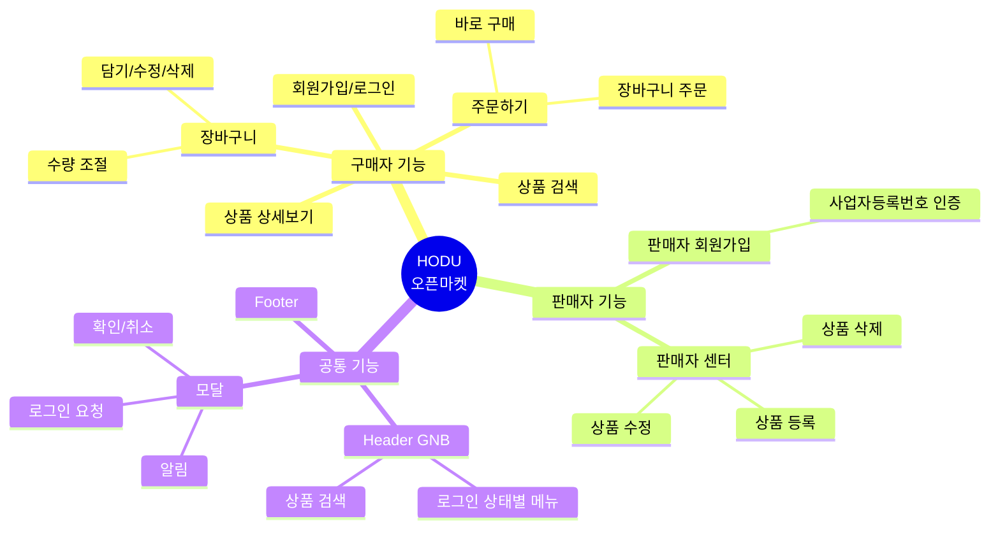
```mermaid
mindmap
  root((HODU<br>오픈마켓))
    구매자 기능
      회원가입/로그인
      상품 검색
      상품 상세보기
      장바구니
        담기/수정/삭제
        수량 조절
      주문하기
        바로 구매
        장바구니 주문
    판매자 기능
      판매자 회원가입
        사업자등록번호 인증
      판매자 센터
        상품 등록
        상품 수정
        상품 삭제
    공통 기능
      Header GNB
        로그인 상태별 메뉴
        상품 검색
      Footer
      모달
        로그인 요청
        확인/취소
        알림
```

### 3.2 기능 명세 - 로그인 흐름

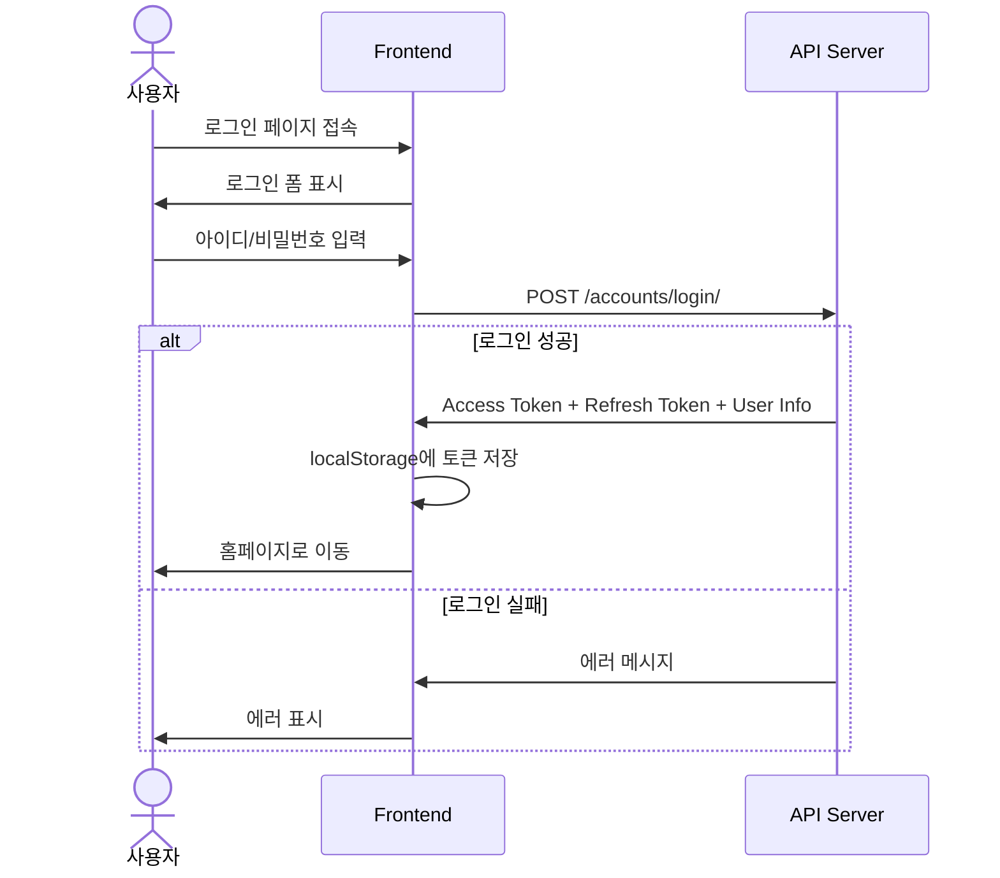
```mermaid
sequenceDiagram
    actor U as 사용자
    participant F as Frontend
    participant A as API Server

    U->>F: 로그인 페이지 접속
    F->>U: 로그인 폼 표시
    U->>F: 아이디/비밀번호 입력
    F->>A: POST /accounts/login/
    alt 로그인 성공
        A->>F: Access Token + Refresh Token + User Info
        F->>F: localStorage에 토큰 저장
        F->>U: 홈페이지로 이동
    else 로그인 실패
        A->>F: 에러 메시지
        F->>U: 에러 표시
    end
```

### 3.3 기능 명세 - 상품 구매 흐름

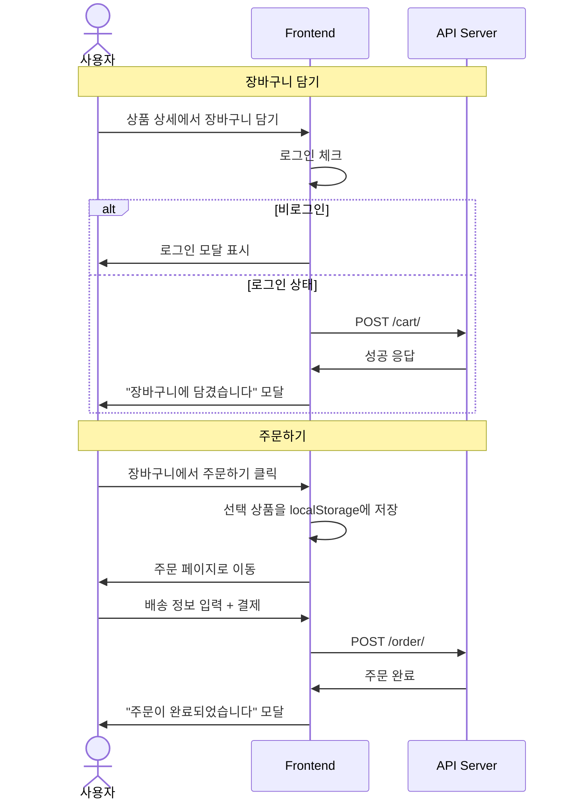
```mermaid
sequenceDiagram
    actor U as 사용자
    participant F as Frontend
    participant A as API Server

    Note over U,A: 장바구니 담기
    U->>F: 상품 상세에서 장바구니 담기
    F->>F: 로그인 체크
    alt 비로그인
        F->>U: 로그인 모달 표시
    else 로그인 상태
        F->>A: POST /cart/
        A->>F: 성공 응답
        F->>U: "장바구니에 담겼습니다" 모달
    end

    Note over U,A: 주문하기
    U->>F: 장바구니에서 주문하기 클릭
    F->>F: 선택 상품을 localStorage에 저장
    F->>U: 주문 페이지로 이동
    U->>F: 배송 정보 입력 + 결제
    F->>A: POST /order/
    A->>F: 주문 완료
    F->>U: "주문이 완료되었습니다" 모달
```

### 3.4 기능 명세 - 판매자 상품 관리

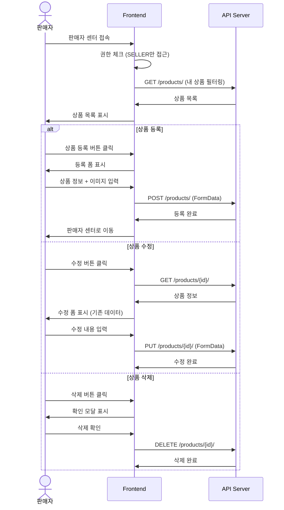
```mermaid
sequenceDiagram
    actor S as 판매자
    participant F as Frontend
    participant A as API Server

    S->>F: 판매자 센터 접속
    F->>F: 권한 체크 (SELLER만 접근)
    F->>A: GET /products/ (내 상품 필터링)
    A->>F: 상품 목록
    F->>S: 상품 목록 표시

    alt 상품 등록
        S->>F: 상품 등록 버튼 클릭
        F->>S: 등록 폼 표시
        S->>F: 상품 정보 + 이미지 입력
        F->>A: POST /products/ (FormData)
        A->>F: 등록 완료
        F->>S: 판매자 센터로 이동
    else 상품 수정
        S->>F: 수정 버튼 클릭
        F->>A: GET /products/{id}/
        A->>F: 상품 정보
        F->>S: 수정 폼 표시 (기존 데이터)
        S->>F: 수정 내용 입력
        F->>A: PUT /products/{id}/ (FormData)
        A->>F: 수정 완료
    else 상품 삭제
        S->>F: 삭제 버튼 클릭
        F->>S: 확인 모달 표시
        S->>F: 삭제 확인
        F->>A: DELETE /products/{id}/
        A->>F: 삭제 완료
    end
```

## 4. 프로젝트 구조와 개발 일정

### 4.1 프로젝트 구조

```
📦 open-market
 ┣ 📜 index.html                     # 메인 페이지 (상품 목록)
 ┣ 📜 vite.config.js                 # Vite 빌드 설정
 ┣ 📜 netlify.toml                   # Netlify 배포 설정
 ┣ 📜 package.json
 ┃
 ┣ 📂 assets
 ┃ ┣ 📂 css
 ┃ ┃ ┣ 📜 reset.css                  # CSS 초기화
 ┃ ┃ ┣ 📜 common.css                 # 공통 스타일 (헤더, 푸터, 모달)
 ┃ ┃ ┗ 📂 pages
 ┃ ┃   ┣ 📜 home.css                 # 메인 페이지
 ┃ ┃   ┣ 📜 login.css                # 로그인
 ┃ ┃   ┣ 📜 signup.css               # 회원가입
 ┃ ┃   ┣ 📜 product-detail.css       # 상품 상세
 ┃ ┃   ┣ 📜 cart.css                 # 장바구니
 ┃ ┃   ┣ 📜 order.css                # 주문
 ┃ ┃   ┣ 📜 seller.css               # 판매자 센터
 ┃ ┃   ┣ 📜 seller-upload.css        # 상품 등록/수정
 ┃ ┃   ┗ 📜 not-found.css            # 404
 ┃ ┃
 ┃ ┣ 📂 js
 ┃ ┃ ┣ 📜 common.js                  # 공통 초기화 (헤더, 푸터 렌더링)
 ┃ ┃ ┗ 📂 pages
 ┃ ┃   ┣ 📜 home.js                  # 상품 목록, 배너, 검색
 ┃ ┃   ┣ 📜 login.js                 # 로그인 처리
 ┃ ┃   ┣ 📜 signup.js                # 회원가입 (유효성 검사)
 ┃ ┃   ┣ 📜 product-detail.js        # 상품 상세, 수량 조절
 ┃ ┃   ┣ 📜 cart.js                  # 장바구니 CRUD
 ┃ ┃   ┣ 📜 order.js                 # 주문 처리
 ┃ ┃   ┣ 📜 seller.js                # 판매자 센터
 ┃ ┃   ┣ 📜 seller-upload.js         # 상품 등록/수정
 ┃ ┃   ┗ 📜 not-found.js             # 404 페이지
 ┃ ┃
 ┃ ┗ 📂 images                        # 아이콘, 이미지 리소스
 ┃   ┣ 📜 Logo-hodu.svg              # 로고
 ┃   ┣ 📜 icon-shopping-cart.svg     # 장바구니 아이콘
 ┃   ┣ 📜 icon-user.svg              # 유저 아이콘
 ┃   ┣ 📜 search.png                 # 검색 아이콘
 ┃   ┗ 📂 cart                        # 장바구니 관련 아이콘
 ┃
 ┣ 📂 components                      # 재사용 컴포넌트
 ┃ ┣ 📜 Header.js                    # 헤더 (로그인 상태별 메뉴)
 ┃ ┣ 📜 Footer.js                    # 푸터
 ┃ ┣ 📜 Modal.js                     # 모달 (로그인, 확인, 알림)
 ┃ ┗ 📂 cart
 ┃   ┣ 📜 CartItem.js                # 장바구니 아이템 컴포넌트
 ┃   ┗ 📜 CartSummary.js             # 결제 요약 컴포넌트
 ┃
 ┣ 📂 utils
 ┃ ┣ 📜 api.js                       # API 통신 + 토큰 관리
 ┃ ┗ 📜 error.js                     # 에러 처리 유틸
 ┃
 ┣ 📂 pages
 ┃ ┣ 📂 login
 ┃ ┃ ┗ 📜 index.html
 ┃ ┣ 📂 signup
 ┃ ┃ ┗ 📜 index.html
 ┃ ┣ 📂 product-detail
 ┃ ┃ ┗ 📜 index.html
 ┃ ┣ 📂 cart
 ┃ ┃ ┗ 📜 index.html
 ┃ ┣ 📂 order
 ┃ ┃ ┗ 📜 index.html
 ┃ ┣ 📂 seller
 ┃ ┃ ┣ 📜 index.html
 ┃ ┃ ┗ 📂 upload
 ┃ ┃   ┗ 📜 index.html
 ┃ ┗ 📂 not-found
 ┃   ┗ 📜 index.html
```

### 4.2 개발 일정 (WBS)

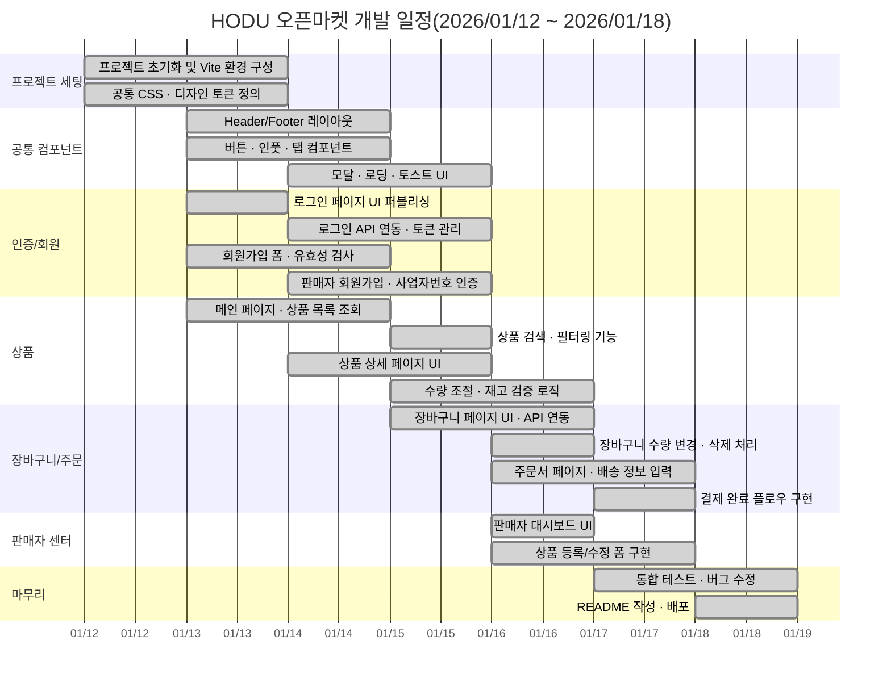
```mermaid
gantt
    title HODU 오픈마켓 개발 일정(2026/01/12 ~ 2026/01/18)
    dateFormat YYYY-MM-DD
    axisFormat %m/%d
    todayMarker off

    section 프로젝트 세팅
    프로젝트 초기화 및 Vite 환경 구성      :done, 2026-01-12, 2d
    공통 CSS · 디자인 토큰 정의           :done, 2026-01-12, 2d

    section 공통 컴포넌트
    Header/Footer 레이아웃               :done, 2026-01-13, 2d
    버튼 · 인풋 · 탭 컴포넌트             :done, 2026-01-13, 2d
    모달 · 로딩 · 토스트 UI              :done, 2026-01-14, 2d

    section 인증/회원
    로그인 페이지 UI 퍼블리싱             :done, 2026-01-13, 1d
    로그인 API 연동 · 토큰 관리           :done, 2026-01-14, 2d
    회원가입 폼 · 유효성 검사             :done, 2026-01-13, 2d
    판매자 회원가입 · 사업자번호 인증      :done, 2026-01-14, 2d

    section 상품
    메인 페이지 · 상품 목록 조회           :done, 2026-01-13, 2d
    상품 검색 · 필터링 기능               :done, 2026-01-15, 1d
    상품 상세 페이지 UI                   :done, 2026-01-14, 2d
    수량 조절 · 재고 검증 로직            :done, 2026-01-15, 2d

    section 장바구니/주문
    장바구니 페이지 UI · API 연동         :done, 2026-01-15, 2d
    장바구니 수량 변경 · 삭제 처리        :done, 2026-01-16, 1d
    주문서 페이지 · 배송 정보 입력        :done, 2026-01-16, 2d
    결제 완료 플로우 구현                 :done, 2026-01-17, 1d

    section 판매자 센터
    판매자 대시보드 UI                    :done, 2026-01-16, 1d
    상품 등록/수정 폼 구현                :done, 2026-01-16, 2d

    section 마무리
    통합 테스트 · 버그 수정               :done, 2026-01-17, 2d
    README 작성 · 배포                   :done, 2026-01-18, 1d
```

## 5. 역할 분담

| 역할 | 담당자 | 담당 업무 |
|------|--------|-----------|
| 팀장 (총괄) | 최서원 | 상품 목록 페이지, Header/Footer, 판매자 센터, 프로젝트 세팅 |
| FE / QA | 박미소 | 로그인 페이지, 모달 컴포넌트, 테스트 및 품질 관리 |
| FE | 김유진 | 회원가입 페이지 (구매자/판매자), 장바구니 페이지 |
| FE / 퍼블리싱 | 김수진 | 상품 상세 페이지, 전체 페이지 CSS 검수 및 수정 |

## 6. 와이어프레임 / UI

### 6.1 와이어프레임

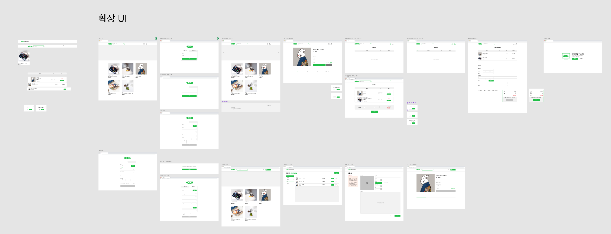

### 6.2 화면 설계

#### 구매자 화면
<table>
    <tbody>
        <tr>
            <td>메인</td>
            <td>로그인</td>
        </tr>
        <tr>
            <td></td>
            <td>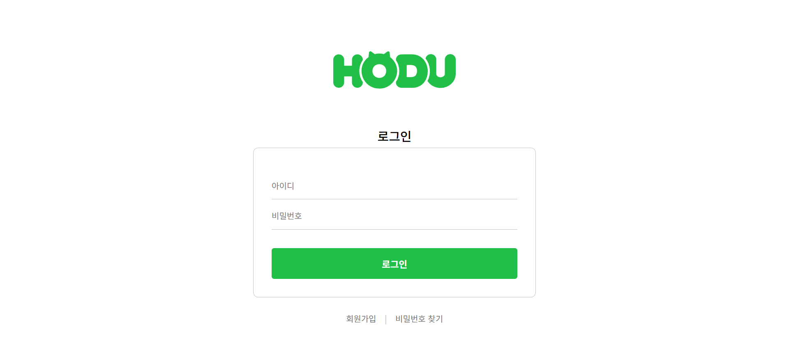</td>
        </tr>
        <tr>
            <td>회원가입</td>
            <td>상품 상세</td>
        </tr>
        <tr>
            <td>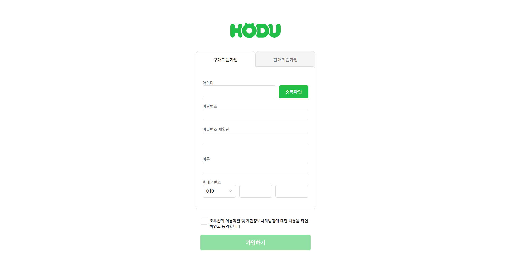</td>
            <td>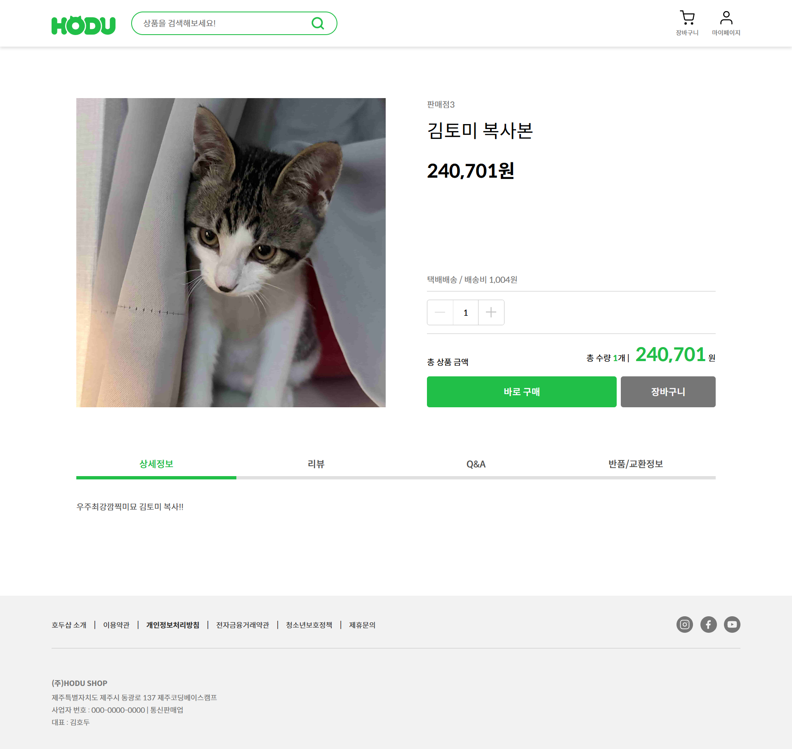</td>
        </tr>
        <tr>
            <td>빈 장바구니</td>
            <td>장바구니</td>
        </tr>
        <tr>
            <td>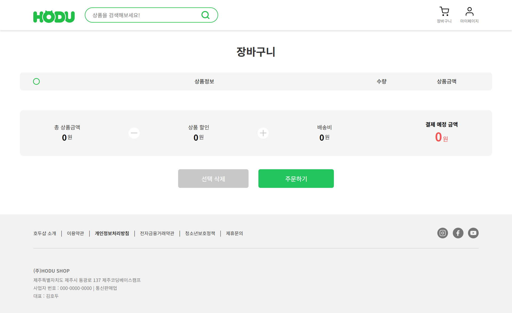</td>
            <td>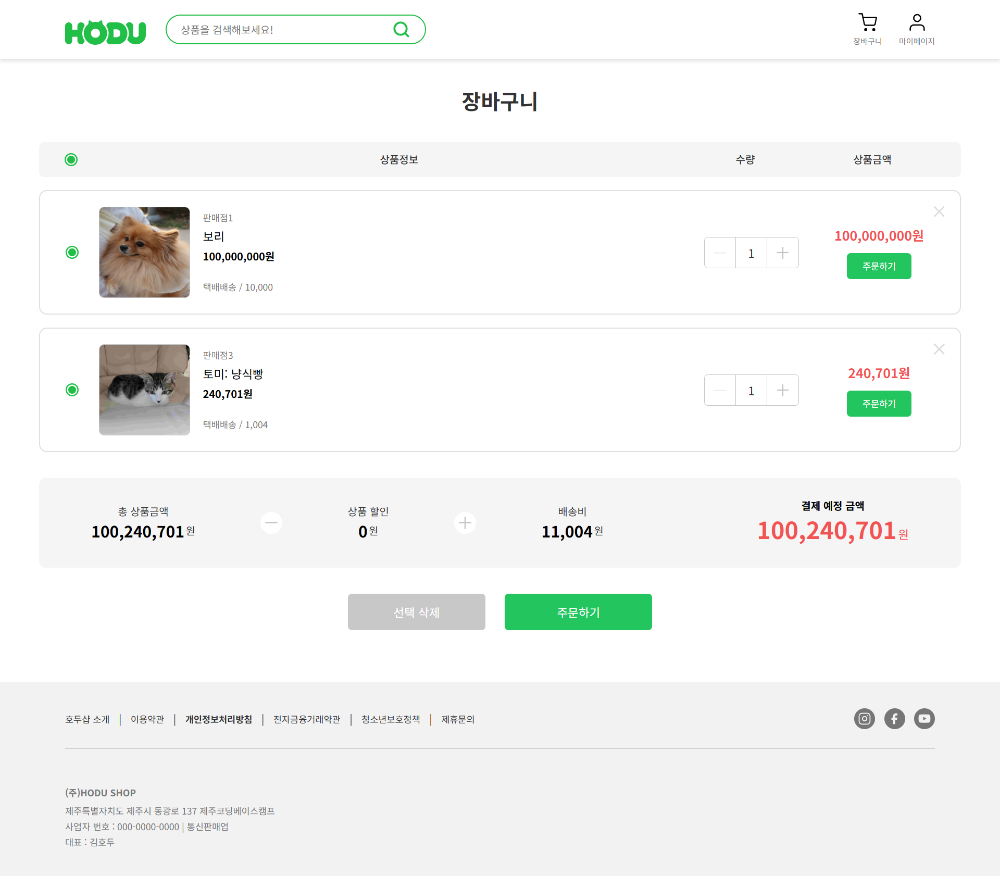</td>
        </tr>
        <tr>
            <td>주문</td>
            <td></td>
        </tr>
        <tr>
            <td>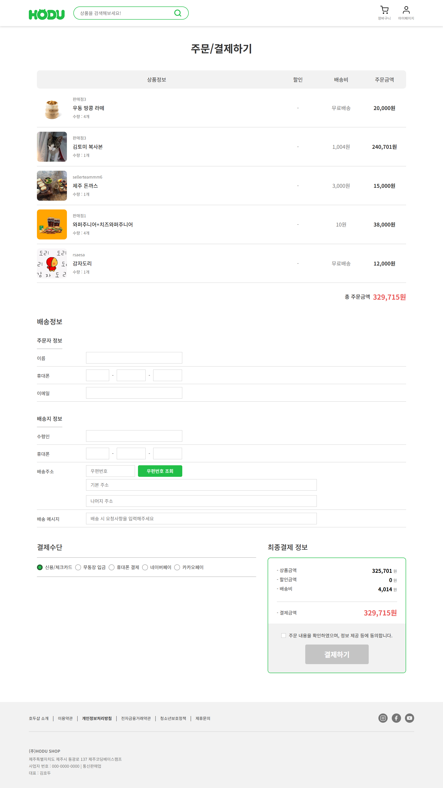</td>
            <td></td>
        </tr>
    </tbody>
</table>

#### 판매자 화면
<table>
    <tbody>
        <tr>
            <td>판매자 메인</td>
            <td>판매자 센터</td>
        </tr>
        <tr>
            <td></td>
            <td>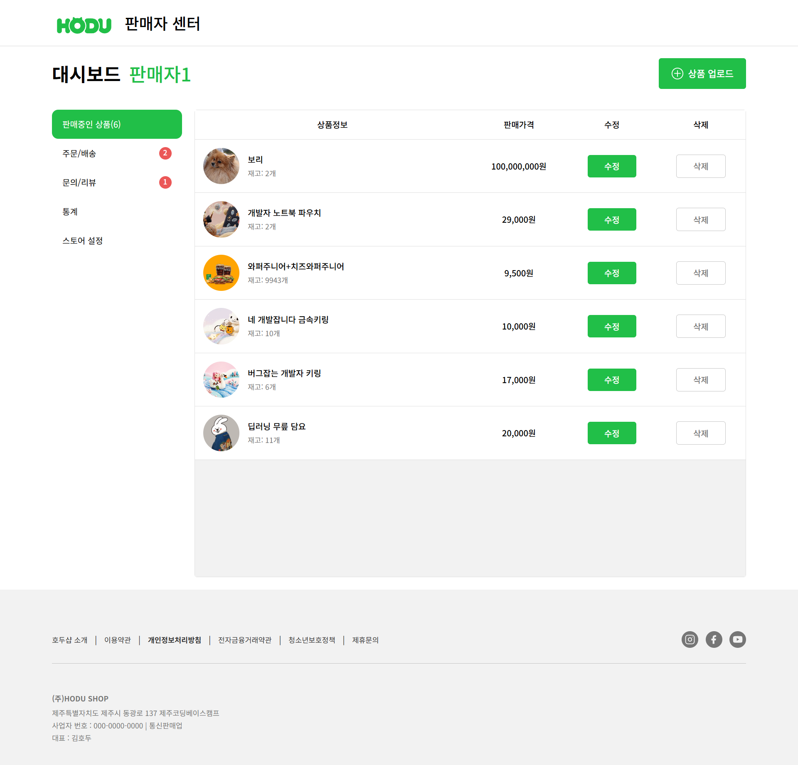</td>
        </tr>
        <tr>
            <td>상품 등록</td>
            <td>판매자 상품 상세</td>
        </tr>
        <tr>
            <td>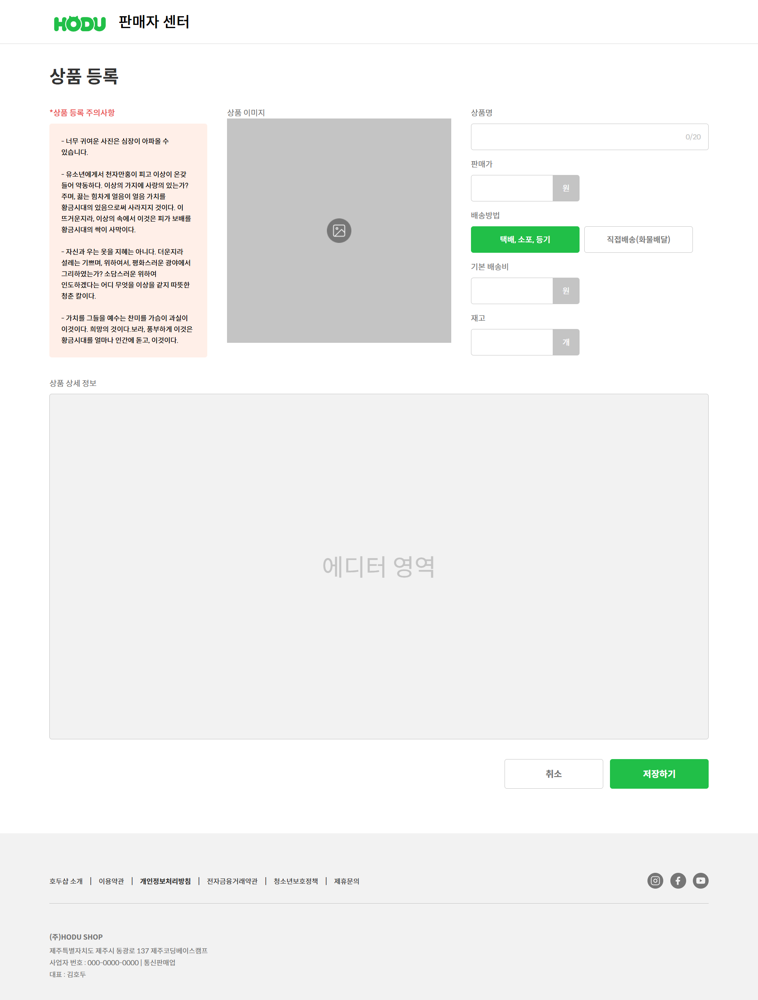</td>
            <td>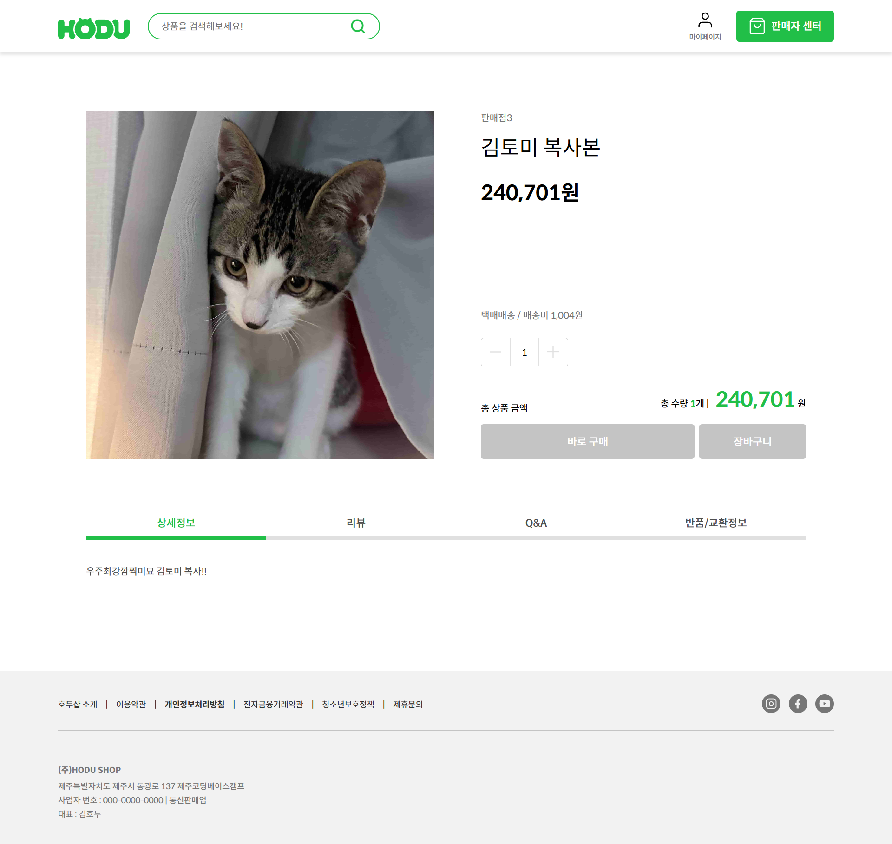</td>
        </tr>
    </tbody>
</table>

#### 기타
<table>
    <tbody>
        <tr>
            <td>404 페이지</td>
        </tr>
        <tr>
            <td>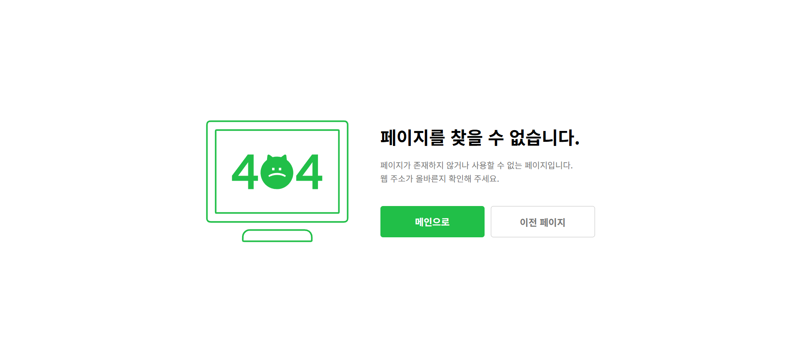</td>
        </tr>
    </tbody>
</table>

## 7. Architecture

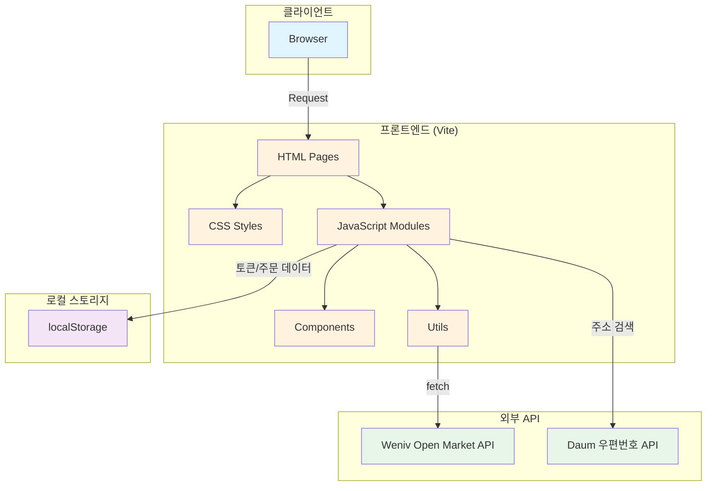
```mermaid
graph TD
    subgraph Client ["클라이언트"]
        B[Browser]
    end

    subgraph Frontend ["프론트엔드 (Vite)"]
        H[HTML Pages]
        C[CSS Styles]
        J[JavaScript Modules]
        CP[Components]
        UT[Utils]
    end

    subgraph Storage ["로컬 스토리지"]
        LS[localStorage]
    end

    subgraph API ["외부 API"]
        WA[Weniv Open Market API]
        DA[Daum 우편번호 API]
    end

    B -->|Request| H
    H --> C
    H --> J
    J --> CP
    J --> UT
    UT -->|fetch| WA
    J -->|토큰/주문 데이터| LS
    J -->|주소 검색| DA

    classDef client fill:#e1f5fe
    classDef frontend fill:#fff3e0
    classDef storage fill:#f3e5f5
    classDef api fill:#e8f5e9

    class B client
    class H,C,J,CP,UT frontend
    class LS storage
    class WA,DA api
```

### 7.1 주요 모듈 관계

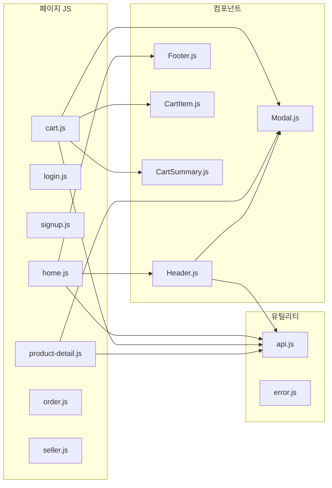
```mermaid
graph LR
    subgraph Pages ["페이지 JS"]
        HOME[home.js]
        LOGIN[login.js]
        SIGNUP[signup.js]
        DETAIL[product-detail.js]
        CART[cart.js]
        ORDER[order.js]
        SELLER[seller.js]
    end

    subgraph Components ["컴포넌트"]
        HEADER[Header.js]
        FOOTER[Footer.js]
        MODAL[Modal.js]
        CARTITEM[CartItem.js]
        CARTSUMMARY[CartSummary.js]
    end

    subgraph Utils ["유틸리티"]
        API[api.js]
        ERROR[error.js]
    end

    HOME --> HEADER
    HOME --> FOOTER
    HOME --> API

    CART --> CARTITEM
    CART --> CARTSUMMARY
    CART --> API
    CART --> MODAL

    DETAIL --> API
    DETAIL --> MODAL

    HEADER --> API
    HEADER --> MODAL
```

## 8. 메인 기능

### 8.1 토큰 기반 인증

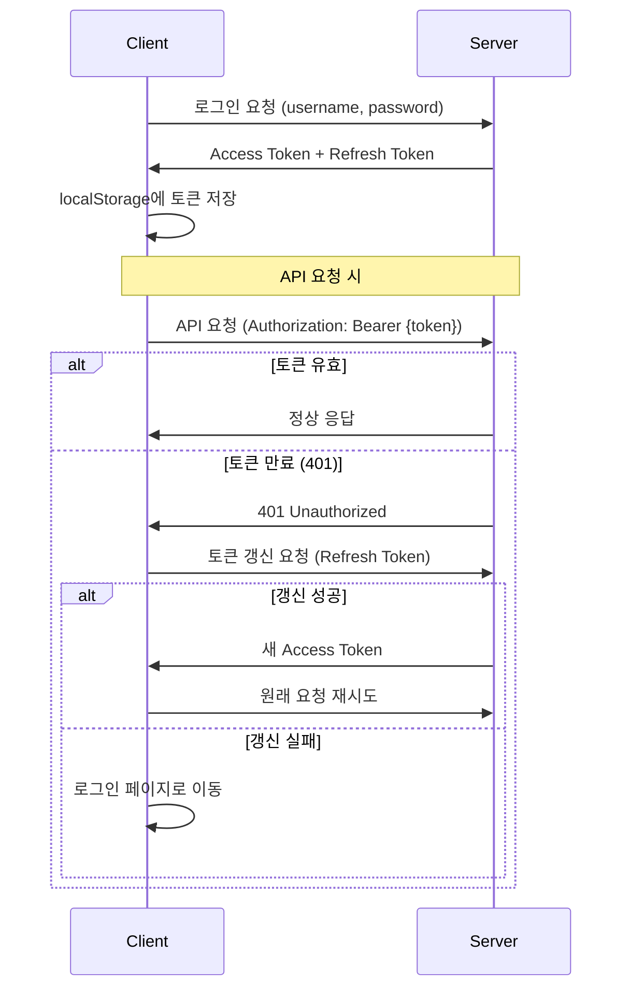
```mermaid
sequenceDiagram
    participant C as Client
    participant S as Server

    C->>S: 로그인 요청 (username, password)
    S->>C: Access Token + Refresh Token
    C->>C: localStorage에 토큰 저장

    Note over C,S: API 요청 시
    C->>S: API 요청 (Authorization: Bearer {token})

    alt 토큰 유효
        S->>C: 정상 응답
    else 토큰 만료 (401)
        S->>C: 401 Unauthorized
        C->>S: 토큰 갱신 요청 (Refresh Token)
        alt 갱신 성공
            S->>C: 새 Access Token
            C->>S: 원래 요청 재시도
        else 갱신 실패
            C->>C: 로그인 페이지로 이동
        end
    end
```

### 8.2 장바구니 → 주문 흐름

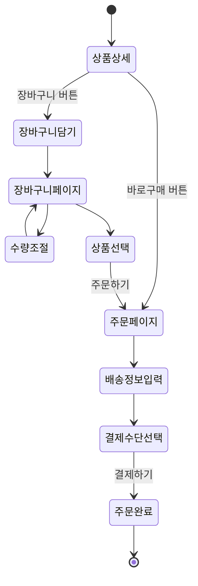
```mermaid
stateDiagram-v2
    [*] --> 상품상세
    상품상세 --> 장바구니담기: 장바구니 버튼
    상품상세 --> 주문페이지: 바로구매 버튼

    장바구니담기 --> 장바구니페이지
    장바구니페이지 --> 수량조절
    수량조절 --> 장바구니페이지
    장바구니페이지 --> 상품선택
    상품선택 --> 주문페이지: 주문하기

    주문페이지 --> 배송정보입력
    배송정보입력 --> 결제수단선택
    결제수단선택 --> 주문완료: 결제하기
    주문완료 --> [*]
```

### 8.3 판매자 상품 관리

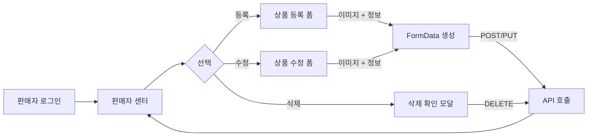
```mermaid
graph LR
    A[판매자 로그인] --> B[판매자 센터]
    B --> C{선택}
    C -->|등록| D[상품 등록 폼]
    C -->|수정| E[상품 수정 폼]
    C -->|삭제| F[삭제 확인 모달]

    D -->|이미지 + 정보| G[FormData 생성]
    E -->|이미지 + 정보| G
    G -->|POST/PUT| H[API 호출]
    F -->|DELETE| H
    H --> B
```

## 9. 트러블 슈팅

### 9.1 [Vite] MPA 동적 라우팅 처리

**문제**: `/product/123` 같은 동적 라우팅 접근 시 404 에러 발생. 배포 후에도 동일 문제 발생.

**원인**: Vite는 기본적으로 SPA용으로 설계되어 MPA에서 동적 경로를 처리하지 못함. Netlify도 별도 설정 필요.

**해결**: 개발 환경과 배포 환경 모두 설정
```javascript
// vite.config.js - 개발 서버용 미들웨어
if (/^\/product\/\d+$/.test(pathname)) {
  req.url = "/pages/product-detail/";
  return next();
}
```
```toml
# netlify.toml - 배포 환경용 리다이렉트
[[redirects]]
  from = "/product/*"
  to = "/pages/product-detail/index.html"
  status = 200
```

**교훈**: Vite를 MPA로 사용하는 레퍼런스가 적어 직접 미들웨어를 구현해야 했음

---

### 9.2 [API] FormData 이미지 업로드 실패

**문제**: 상품 등록 시 이미지 업로드가 실패함

**원인**: `Content-Type: multipart/form-data`를 직접 설정하면 boundary가 누락됨

**해결**: JSON 요청과 FormData 요청을 별도 함수로 분리
```javascript
// fetchAPI - JSON 요청용
const config = {
  headers: { "Content-Type": "application/json", ... }
};

// fetchFormAPI - FormData 요청용
const config = {
  headers: {
    ...(token && { Authorization: `Bearer ${token}` }),
    // Content-Type 미설정! (브라우저가 boundary 포함하여 자동 설정)
  },
};
```

**교훈**: FormData 사용 시 Content-Type을 명시하면 안 됨. 브라우저가 자동으로 boundary를 생성해야 함.

---

### 9.3 [비동기] 로그인 버튼 중복 클릭 방지

**문제**: 사용자가 로그인 버튼을 빠르게 여러 번 클릭하면 중복 요청이 발생

**원인**: 비동기 요청 중에 버튼 상태를 관리하지 않음

**해결**: `disabled` 속성과 `try-finally` 구문으로 버튼 상태 관리
```javascript
loginForm.addEventListener("submit", async (e) => {
  e.preventDefault();
  if (submitBtn.disabled) return; // 중복 클릭 방지

  try {
    submitBtn.disabled = true; // 요청 시작 시 버튼 잠금
    const data = await login(username, password);
    // ...
  } catch (error) {
    showError(error.data?.error);
  } finally {
    submitBtn.disabled = false; // 성공/실패 상관없이 버튼 활성화
  }
});
```

**교훈**: 네트워크 요청 중에는 항상 중복 전송 방지 로직 필수

---

### 9.4 [비동기] 장바구니 일괄 삭제 성능 개선

**문제**: 선택한 여러 상품을 하나씩 삭제하면 느리고, 순차 삭제 중 일부 실패 시 처리가 애매함

**원인**: for문으로 순차적으로 API를 호출하면 N개 삭제 시 O(N) 시간 소요

**해결**: `Promise.all`로 병렬 처리
```javascript
$deleteSelectedBtn.onclick = async () => {
  const selectedItems = cart.filter((item) => item.checked);

  try {
    // 여러 요청을 동시 실행 (병렬)
    await Promise.all(selectedItems.map((item) => deleteCartItem(item.id)));

    // 모두 성공하면 프론트 상태 업데이트
    cart = cart.filter((item) => !item.checked);
    renderCart();
  } catch (e) {
    showAlertModal("선택 상품 삭제에 실패했습니다.");
  }
};
```

**교훈**: 독립적인 여러 비동기 작업은 `Promise.all`로 병렬화하면 성능 향상

---

### 9.5 [상태관리] 배너 자동재생 인터벌 중복 실행

**문제**: 배너가 자동 재생 중일 때 사용자가 화살표를 클릭하면 여러 인터벌이 동시에 실행되어 배너가 빠르게 움직임

**원인**: 새 인터벌 시작 전 기존 인터벌을 정리하지 않음

**해결**: 인터벌 ID를 추적하고, 새 인터벌 시작 전 기존 것을 정리
```javascript
let autoPlayTimer = null;

const startAutoPlay = () => {
  stopAutoPlay(); // 기존 인터벌 먼저 정리!
  autoPlayTimer = setInterval(nextSlide, 4000);
};

const stopAutoPlay = () => {
  if (autoPlayTimer) {
    clearInterval(autoPlayTimer);
    autoPlayTimer = null;
  }
};

prevBtn?.addEventListener("click", () => {
  prevSlide();
  startAutoPlay(); // 클릭 시 인터벌 리셋
});
```

**교훈**: `setInterval` 사용 시 반드시 `clearInterval`로 정리하고, 중복 실행 방지

---

### 9.6 [비동기] ID 중복확인 Race Condition

**문제**: ID 중복확인 버튼 클릭 중에 input에서 blur 이벤트가 발생하면, 비동기 응답 순서가 꼬여서 잘못된 에러 메시지가 표시됨

**원인**: 비동기 요청 진행 중 상태를 추적하지 않음

**해결**: `mousedown`과 `click` 이벤트를 분리하고 플래그로 상태 관리
```javascript
let checkingId = false;

// mousedown은 blur보다 먼저 발생
checkBtn.addEventListener("mousedown", () => {
  checkingId = true;
});

checkBtn.addEventListener("click", async () => {
  try {
    await validateUsername(idInput.value);
    idOk = true;
  } catch (err) {
    idOk = false;
  }
  checkingId = false; // 요청 완료
});

idInput.addEventListener("blur", () => {
  if (checkingId) return; // 검사 중이면 에러 표시 안 함
  // ...
});
```

**교훈**: 비동기 작업의 상태 플래그로 race condition 방지

---

### 9.7 [데이터전달] 페이지 간 복잡한 데이터 전달

**문제**: 장바구니에서 주문 페이지로 여러 상품 정보(객체 배열)를 전달해야 하는데, URL 파라미터로는 한계가 있음

**원인**: URL 파라미터는 문자열만 가능하고 길이 제한이 있음

**해결**: `localStorage`와 JSON 직렬화 활용
```javascript
// cart.js - 데이터 저장
const orderData = {
  orderType: "cart",
  items: checkedItems.map((item) => ({
    id: item.productId,
    name: item.name,
    price: item.price,
    quantity: item.qty,
    // ...
  })),
};
localStorage.setItem("orderData", JSON.stringify(orderData));
window.location.href = "/pages/order/";

// order.js - 데이터 사용
const orderData = JSON.parse(localStorage.getItem("orderData"));
if (!orderData?.items?.length) {
  window.location.href = "/";
}
// 사용 후 정리
localStorage.removeItem("orderData");
```

**교훈**: 복잡한 데이터는 `localStorage` + JSON 활용. 단, 민감한 정보는 저장하지 말 것.

---

### 9.8 [배포] Netlify 환경에서 CSS 로드 실패

**문제**: 로컬에서는 정상이나 Netlify 배포 후 스타일이 적용되지 않음

**원인**: Vite 개발 서버와 빌드 결과물의 경로 처리 방식 차이

**해결**: 각 페이지 `main.js`에서 CSS를 명시적으로 import (21개 파일 수정)
```javascript
// 각 페이지의 main.js
import '../assets/css/pages/home.css';
```

**교훈**: 로컬과 배포 환경의 차이를 항상 고려하고, 배포 전 빌드 테스트 필수

---

## 10. 리팩토링

### 10.1 [보안] innerHTML을 DOM API로 전환 (XSS 취약점 방지)

**상황**: `home.js`, `order.js`, `CartItem.js` 등에서 사용자 데이터를 `innerHTML`로 직접 삽입

**원인**: 상품명에 `<script>alert('hack')</script>`가 포함되면 그대로 실행될 수 있음

**해결**:
```javascript
// Before (취약)
li.innerHTML = `<p class="name">${item.name}</p>`;

// After (안전)
const nameP = document.createElement("p");
nameP.className = "name";
nameP.textContent = item.name;  // HTML 이스케이프 자동 처리
li.appendChild(nameP);
```

**성과**: 21개 파일, 613줄 추가/395줄 삭제의 대규모 리팩토링으로 XSS 취약점 제거

---

### 10.2 [스타일] CSS !important 남용 문제 해결

**상황**: `cart.css`, `product-detail.css`, `seller.css`에서 `!important` 과도 사용

**해결**: CSS 선택자 우선순위 분석 후 선택자 구조 정리
```css
/* Before */
border: none !important;

/* After */
border: none;
```

**성과**: 3개 파일에서 불필요한 `!important` 8개 제거

---

### 10.3 [접근성] 스크린리더를 위한 ARIA 속성 추가

**상황**: 버튼, 탭, 드롭다운에 스크린리더 사용자를 위한 정보 부족

**해결**:
```javascript
minusBtn.setAttribute("aria-label", "수량 감소");
plusBtn.setAttribute("aria-label", "수량 증가");
trigger.setAttribute("aria-expanded", "true");
```

**성과**: 8개 파일에 ARIA 속성 추가, 웹 접근성(WCAG) 기준 충족

---

### 10.4 [UX] alert()를 커스텀 모달로 전환

**상황**: 브라우저 기본 `alert()`는 디자인 커스터마이징 불가

**해결**: Promise 기반 `showAlertModal()` 구현
```javascript
// Before
alert("주문이 완료되었습니다!");

// After
await showAlertModal("주문이 완료되었습니다!");
```

**성과**: 일관된 UI/UX 및 비동기 흐름 제어 가능

---

### 10.5 [유지보수] 매직 넘버를 상수로 추출

**상황**: `signup.js`에서 `150`, `90`, `6` 같은 숫자가 의미 없이 사용됨

**해결**:
```javascript
// Before
const visibleHeight = 150;

// After
const DROPDOWN_VISIBLE_HEIGHT = 150;
```

**성과**: 코드 가독성 향상, 유지보수 용이

---

### 10.6 [코드 품질] DOM 요소 변수명 컨벤션 통일

**상황**: DOM 요소와 일반 변수 구분이 어려움

**해결**: `$` 접두사로 DOM 요소 명시
```javascript
// Before
const orderItemList = document.getElementById("orderItemList");

// After
const $orderItemList = document.getElementById("orderItemList");
```

**성과**: 코드 리뷰 시 DOM 요소와 일반 변수 즉시 구분 가능

## 11. 개발하며 느낀점

### 최서원 (팀장)
- 이번 프로젝트에서 처음으로 팀장 역할을 맡으며 개발과 협업 전반에 대한 시야를 넓힐 수 있었습니다. 프로젝트 초반에는 작업 분배와 일정 관리, 기술적 의사결정이 모두 낯설어 막막함을 느꼈지만, 문제를 하나씩 해결해 나가며 성장할 수 있었습니다. 특히 API 통신을 직접 설계하며 비동기 처리와 에러 핸들링, 토큰 관리 등 서비스 흐름을 고려한 개발의 중요성을 체감했습니다. 또한 리팩토링 과정에서 유지보수 가능한 구조와 초기 설계의 중요성을 깨달았고, 컨벤션 부재로 인한 협업 비용을 경험하며 명확한 규칙의 필요성을 인식했습니다. Git 사용을 함께 정리하며 팀원들과 지식을 공유한 경험을 통해 협업의 본질은 결과물이 아니라 함께 성장하는 과정임을 배웠습니다.

### 박미소
- 처음 팀이 짜였을 때는 솔직히 기대보다 걱정이 훨씬 앞섰습니다. 기본 구조를 잡는 것부터 협업 툴 사용까지 모든 게 낯설고 서툴다 보니, 팀에 민폐가 되지는 않을까 하는 생각에 심리적으로 많이 위축되기도 했습니다. 하지만 포기하지 않고 부딪혀보니 어렵게만 느껴졌던 코드와 툴들이 어느덧 손에 익고 친숙해지기 시작했습니다. 팀원들의 도움을 받아 하나씩 해결해 가는 과정에서 단순히 지식을 얻는 것을 넘어, '나도 할 수 있다'는 자신감을 얻은 것이 가장 큰 수확이었습니다.
정신적으로나 체력적으로 한계에 부딪히는 순간도 분명 있었지만, 그만큼 몰입했기에 기술적으로나 인간적으로나 한 단계 더 성장할 수 있었습니다. 이번 프로젝트는 저에게 있어 막연한 두려움을 확신으로 바꿀 수 있었던 값진 시간이었습니다.

### 김유진
- 작성 예정

### 김수진
- Git 용어들을 자연스럽게 사용하는 데 익숙해져야겠다. 이번에 HTML과 CSS를 함께 수정해 보면서, 두 언어의 구조를 예전보다 훨씬 더 잘 이해하게 되었다. 최근에 진행한 HTML·CSS 수정 작업을 통해, 마크업 구조와 스타일 구조가 어떻게 연결되는지 그리고 버튼 클릭이후 호출되는 API로 응답 받은 데이터로 화면이 업데이트되는 이 패턴이 계속 반복되는 구조도 더 분명하게 이해해야겠다.

---

## 참고 자료

- [Weniv Open Market API 문서](https://api.wenivops.co.kr/services/open-market/)
- [Vite 공식 문서](https://vitejs.dev/)
- [Daum 우편번호 서비스](https://postcode.map.daum.net/guide)